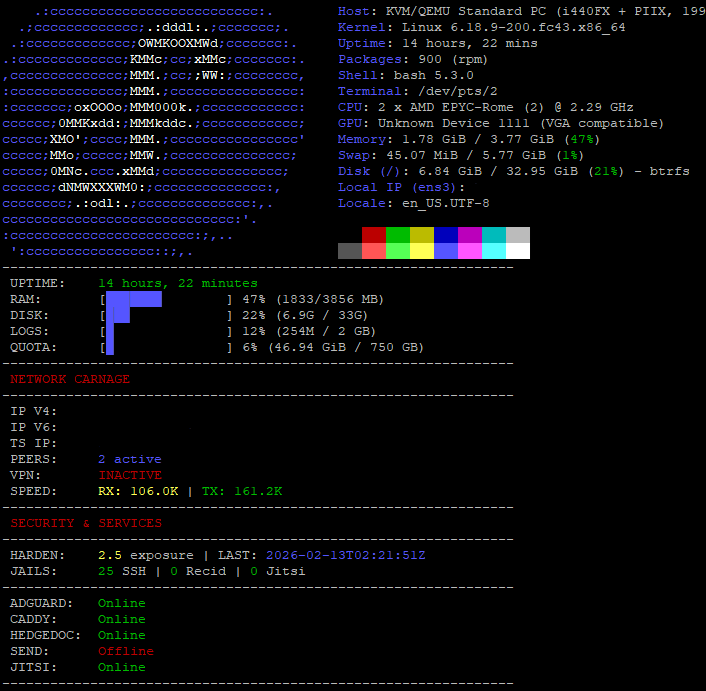

# Syscheck Dashboard 🚀


A lightweight, high-visibility system dashboard for Fedora Cloud, optimized for mobile SSH. Designed for the "Imperator" node.

## 🏗 Architecture: The "Split Engine" Model
The project uses a hybrid architecture to ensure stability on narrow mobile screens:
* **Python Engine (`syscheck-engine`)**: Handles the heavy lifting—API calls (AdGuard), delta-math (Traffic), and system parsing. It outputs a single pipe-delimited string to prevent "ghost characters" and line-wrapping bugs.
* **Bash Display (`syscheck`)**: Handles the aesthetic—renders the UI, progress bars, and high-visibility colors.

## 🛠 Features
- **Fastfetch Integration**: Clean system info and OS branding.
- **Resource Bars**: Visual RAM, CPU, and Disk usage (optimized for 15-char mobile width).
- **Node Life & Health**: Tracking server age and **dnf5 reboot requirements**.
- **Security Carnage**: Live tracking of Fail2Ban hits, Recidive bans, and SSH threats.
- **Service Heartbeat**: 
    - **Caddy & HedgeDoc**: Status tracking via API/HTTP codes.
    - **AdGuard Home**: Live DNS block counts and filtering efficiency via Basic Auth.
- **Network Stats**: Tailscale IP tracking and real-time Up/Down traffic sampling.

## 📦 Dependencies
Ensure these are installed on your Fedora system:
- `python3` (for the data engine)
- `fastfetch` (for the header)
- `vnstat` (for bandwidth/quota tracking)
- `procps-ng` (for `top` and `free` commands)

## 🚀 Installation
1. Clone this repo: `git clone https://github.com/your-repo/syscheck-project.git ~/syscheck-project`
2. Create an alias: `echo "alias syscheck='~/syscheck-project/syscheck'" >> ~/.bashrc`
3. Ensure AdGuard credentials are exported in your `~/.bashrc`:
   ```bash
   export AG_USER="your_user"
   export AG_PASS="your_password"

