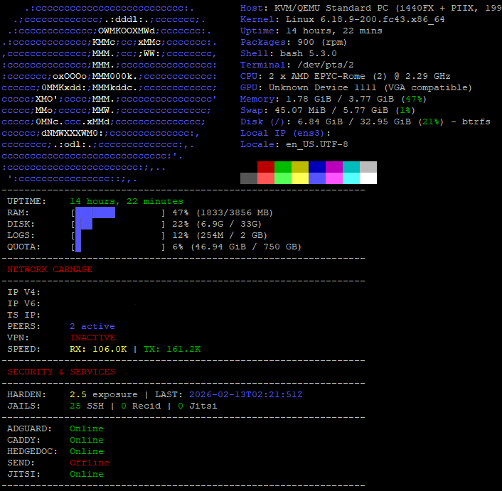

# Syscheck Dashboard 🚀

A lightweight, high-visibility system dashboard for Fedora 43 Cloud, optimized for mobile SSH. Designed for the "Imperator" node.

## 🏗 Architecture: The "Split Engine" Model
The project uses a hybrid architecture to ensure stability on narrow mobile screens:
* **Python Engine (`syscheck-engine`)**: Handles the heavy lifting—vnStat 2.13 (SQLite) parsing, real-time traffic delta-math (ens3), and service heartbeats. It outputs a single pipe-delimited string to prevent "ghost characters" and line-wrapping bugs.
* **Bash Display (`syscheck`)**: Handles the aesthetics—renders the UI, dynamic progress bars with "round-up" logic, and high-visibility colors.

## 🛠 Features
- **Fastfetch Integration**: Clean system info and OS branding for Fedora 43.
- **Dynamic Resource Bars**: Visual RAM, Disk, and Quota usage optimized for 15-char mobile width.
- **Billing Cycle Tracking**: Tracks a **750 GB monthly budget** resetting on the **13th** of every month.
- **Security & Jails**: Live tracking of **Fail2Ban** hits across **SSH, Recidive, and Jitsi-Auth** jails. Includes `systemd-analyze` exposure scores.
- **Terraria Monitoring**: Live player count (Map: Med) and dynamic FPS calculation based on system load.
- **Service Heartbeat**:
    - **Jitsi**: Rootless Podman status tracking (Bridge/Host aware).
    - **Caddy, HedgeDoc, & AdGuard**: Real-time status tracking via HTTP response codes.
    - **Tailscale**: Detects exit-node status and active peers.
- **Network Carnage**: Real-time RX/TX traffic sampling on the `ens3` interface.

## 📦 Dependencies
- `python3` (Engine)
- `fastfetch` (Header)
- `vnstat` (v2.10+ SQLite)
- `tailscale` (VPN)
- `fail2ban` (Jails)
- `podman` (Container stats)

## 🚀 Installation
1. Clone: `git clone https://github.com/ypcodingindustries/syscheck.git ~/syscheck-project`
2. Alias: `alias syscheck='~/syscheck-project/syscheck'`
3. Run: `syscheck`
